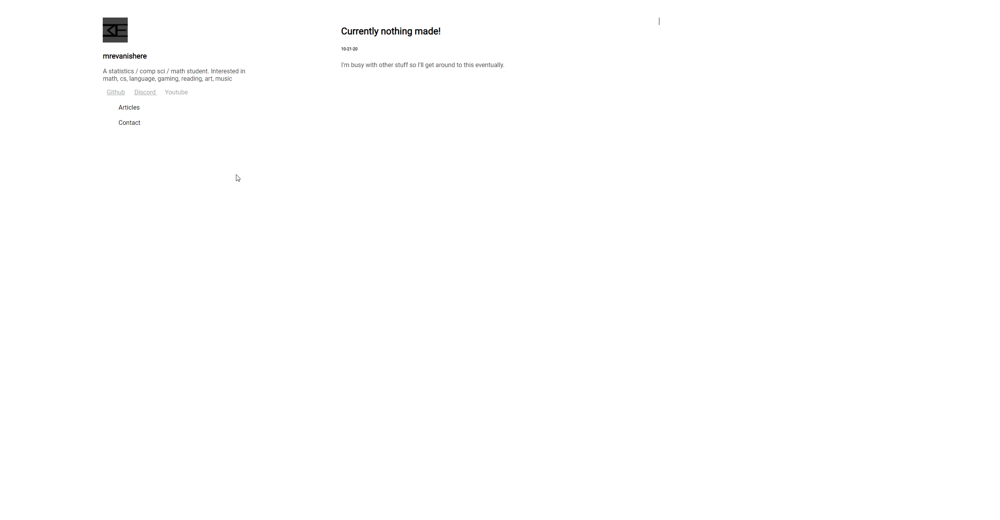

# Django Site
This is some of the code from my website [mrevanishere](https://mrevanishere.com).


# Development
## Dev Setup
0. 
pip
```
sudo apt-get update
sudo apt-get install libpq-dev python-dev
pip3 install django
pip3 install django-ckeditor
pip3 install psycopg2-binary psycopg2
```
1. Create a venv and install requirements
    sudo pip3 install virtualenv
2. django
3. Gitflow

## Prod Setup
1. on Linode #TODO move to AWS
2. apache #TODO move to nginx
3. SQLite #TODO move to PostgreSQL or MongoDB
4. add auth0 login (as fastapi separate service)
5. manage the server on a container instead of base OS
* TODO: change db keys to env files


## Update prod
0. Load dev branch + VENV + pip + test run,
1. make multiple branches (dev branch and master branch)
2. python manage.py check
3. update requirements.txt
4. Commit and push to dev branch
5. Merge everything except settings to master
6. push to dev parts to master
7. 
8. apache reload

## Create django app
1. `django-admin startproject mysite`
2. `python manage.py startapp <name of app>`
3. in site settings
    1. update INSTALLED_APPS with apps
    2. updated ALLOWED_HOSTS to localhost, 127.0.0.1 for dev 
4. Configure blog app
5. `python manage.py makemigrations`
6. add a user with 
    https://docs.djangoproject.com/en/3.2/topics/auth/default/
    https://docs.djangoproject.com/en/3.2/topics/auth/default/#creating-users

## What's the best way to handle a finite amount of users? Login page with no sign up.
* only staff users can view forms

## TODO
* Create DB separate from webserver (MongoDB on AWS)


---
# Site

## Motivation
I wanted to build this to have a nice place to host my future projects and portfolio and to learn Django.

## Tech
Built with LAPP stack (Linux, Apache, PostgreSQL, Python)
* Django
* debian
* apache
* PostgreSQL
* SQLite
* https


# Tabs/Features
## Version 1.0


## Articles
Home / Updates
## Contact
A list of places to find me.
